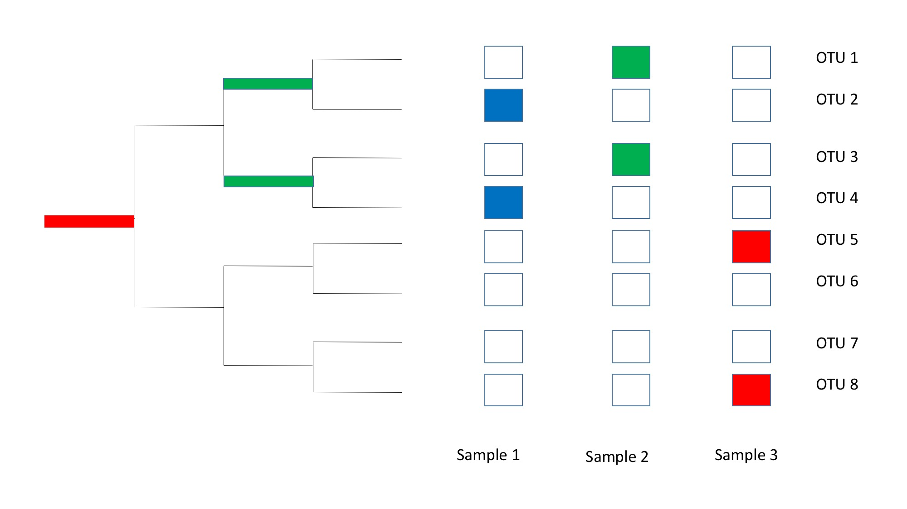

# Kernel Methods

Kernel methods aim to quantify dissimilarity between microbial communities. While phylogentic variables simplify a single community into biologically interpretable variables, kernel methods are necessarily comparative and describe distances between two communities.  By defining a distance between two microbial communities, it is possible to perform classification, cluster communities, and describe how microbial communities are impacted by specific environmental variables. By using the phylogeny to define distances, it may be possible to obtain more biologically meaningful measures of similarity between communities.

One of the most commonly used distance metrics in microbial ecology is [Unifrac](http://aem.asm.org/content/71/12/8228.short).  Unifrac combines patterns of abundance with the evolutionary history of the microbes to quantify a measure of the evolutionary difference of communities.

To illustrate how Unifrac works, consider the following example of three samples that contain microbial communities comprised of 9 different species.



None of the communities have any species in common, yet we wish to define a measure of similarity between the samples. We can see that the species between Sample 1 and Sample 2 have more shared common ancestry compared to the species between Sample 1 and Sample 3.

Unifrac attempts to resolve the differences between microbial communities, even when species do not overlap, by incorporating the extent of shared ancestry as a measure of similarity or, conversely, the extent of novel evolutionary lineages, optionally weighted by the relative abundance of novel lineages, as a measure of dissimliarity. Unifrac has been shown to be a variant of the [Earth Mover's Distance](https://en.wikipedia.org/wiki/Earth_mover%27s_distance), which is a measure of how much relative abundance ("Earth") one would need to move along a graph (the phylogeny) to obtain one community from another. Through that lense, Unifrac can be thought of as a technique that calculates the flow of species abundances through the common ancestors between microbial communities.

To show how to run Unifrac, we'll use hte RNA copy number simulation shown in the PVA tutorial.  We'll boot up rpy2 to embed R inside of Python in order to use the scikit-bio implementation of Weighted Unifrac.


```python
import warnings
warnings.filterwarnings("ignore")
%load_ext rpy2.ipython
```


```python
%%R -o OTUTable -o disturbance_frequency

library(ape)
library(phytools)
library(magrittr)
library(nlme)
set.seed(1)
tree <- rtree(10)
n <- 25
disturbance_frequency <- rexp(n) %>% sort %>% log

Q <- diag(9) %>% cbind(rep(0,9),.) %>% rbind(.,rep(0,10)) 
Q <- Q+t(Q)-diag(10)
# Q <- Q
RNAcopyNumber <- sim.history(tree, Q, anc = '3')


abundances <- function(dst,RNAcopy){
  m <- length(RNAcopy)
  muTot <- 1e4   ##a mean of 10,000 sequence counts per sample.
  logmu <- 3 * dst * log(RNAcopy) #model to yield linear changes in log-ratios
  muRel <- exp(logmu) / sum(exp(logmu))  #mean relative abundances 
  mu = muRel * muTot
  size = 1
  N <- rnbinom(m, size, mu=mu)
}

OTUTable <- sapply(as.list(disturbance_frequency),
                   FUN=function(dst, c) abundances(dst, c),
                   c=as.numeric(RNAcopyNumber$states)) %>% matrix(., ncol=n, byrow=F)
OTUTable <- as.data.frame(OTUTable)
rownames(OTUTable) <- names(RNAcopyNumber$states)
write.tree(tree, file='tree.nwk', tree.name=TRUE)
```


    Some columns (or rows) of Q don't sum to 0.0. Fixing.
    Done simulation(s).


Now, we'll read in the tree and table from R simulation, allowing us to run Weighted Unifrac in python and obtain a pairwise distance matrix.  The pairwise distance matrix contains the distances of all possible pairs of samples.


```python
from skbio import TreeNode
from skbio.diversity import beta_diversity
tree = TreeNode.read('tree.nwk')
table = OTUTable.astype(int).T
wu_dm = beta_diversity("weighted_unifrac", table.values, table.index, tree=tree,
                        otu_ids=table.columns)
```

We can plot the distance matrix to see which samples are most similar to each other using Unifrac.


```python
wu_dm
```


The samples V1 through V10 have small distances, indicating that these communities are similar to each other under Unifrac's measure of similarity. Small distances between samples V1 through V10 is consistent with the underlying evolutionary and ecological model as these communities are primarily composed of low RNA copy number microbes in low disturbance-frequency environments.

Samples V1 through V10 are very different to V15 through V25, which is also consistent with the underlying model as V15 through V25 are more even and favor more high RNA copy number species, species whose phylogenetic dissimilarity is concurrent with their dissimilar traits and, consequently, habitat assocation.

Where the phylogeny captures common ancestry of traits driving similar habitat association or responses to treatment, incorporating the phylogeny into a distance metric can improve the resolution of kernel methods. For comparison, we'll run Bray Curtis to see how well it can differentiate these samples.


```python
bc_dm = beta_diversity("braycurtis", table.values, table.index)
bc_dm
```


As we can see here, Bray Curtis is able to highlight the differences between the V1-V10 and V15-V25 communities.  However, because this metric is agnostic to underlying phylogeny, it mistakenly identifies the low RNA copy number communities to be dissimilar communities. Consequently, where there is a phylogenetic signal in habitat association, even a crude incorporation of phylogenetic distances may enhance classification, clustering, and biological interpretation.

To visualize how these samples differ, it is common to use Principal Coordinates Analysis (PCoA) to embed samples into a lower-dimension scatterplot.  PCoA plots help visualize which environmental factors are driving the separation between communities by coloring points by environmental meta-data. We will color points (samples) by disturbance frequency in a PCoA plot to confirm that disturbance-frequency is associated with community differences.


```python
import pandas as pd
from skbio.stats.ordination import pcoa

samp_md = pd.DataFrame(disturbance_frequency, index=table.index, columns=['Disturbance_Frequency'])
pc = pcoa(wu_dm)
pc.plot(samp_md, 'Disturbance_Frequency',
        axis_labels=('PC 1', 'PC 2', 'PC 3'),
        title='Disturbance_Frequency', cmap='jet', s=50)
```


Coloring points by an unrelated covariate, such as an independently simulated Gaussian vector, would lead to a scatter of colors unrelated to the position of points on the PCoA plot. However, the gradient of colors - blue to orange - along a gradient of PCoA positions visualizes that disturbance frequency is associated with differences between the microbial communities.

# Summary - Kernel Methods

Kernal Methods define distances between communities and produce a community-level understanding about which environmental variables are associated with differences between microbial communities. Kernel methods which incorporate phylogenetic features, such as Unifrac, can classify, cluster, and reveal patterns of dissimilarity between communities when the phylogeny conveys information about traits driving community structure.  Where the phylogeny does contain information on traits and community structure, failing to incorporate the phylogeny can lead to misleading interpretations about the underlying system.

Kernel methods are subject to similar assumptions, limitations, and special considerations as are other classes of phylogenetically-structured data analysis, including the nature of the data (are the data compositional?), the expected changes in abundance (arithmetic or geometric?), and the biological interpretation & implications of dissimilar communities. When defining a novel kernel, such as generalized Unifrac distances or other metrics, one effectively needs to define the dissimilarity between two species. How different is an owl from a platypus? Are all branch-lengths treated similarly as calculated in phylogenetic inference, or are there some branches which should be lengthened with prior information, such as those along which highly significant and differentiating traits arose (e.g. flight that arose with Aves, or milk which arose with Mammalia)? 

The "best" measure of difference between species and, consequently, differences between communities comprised of different species, may depend the research questions such as the particular environmental covariates or treatments to which communities are exposed. For some covariates and treatments, there may be traits with phylogenetic signal driving patterns of abundance, whereas for others, population and community-level responses may be modulated by recently evolved traits or horizontally transmitted genes. Consequently, it's unlikely that one distance metric is appropriate for all communities; in fact, the utility of one distance metric over another may reveal information about the nature of traits driving changes in abundance. 